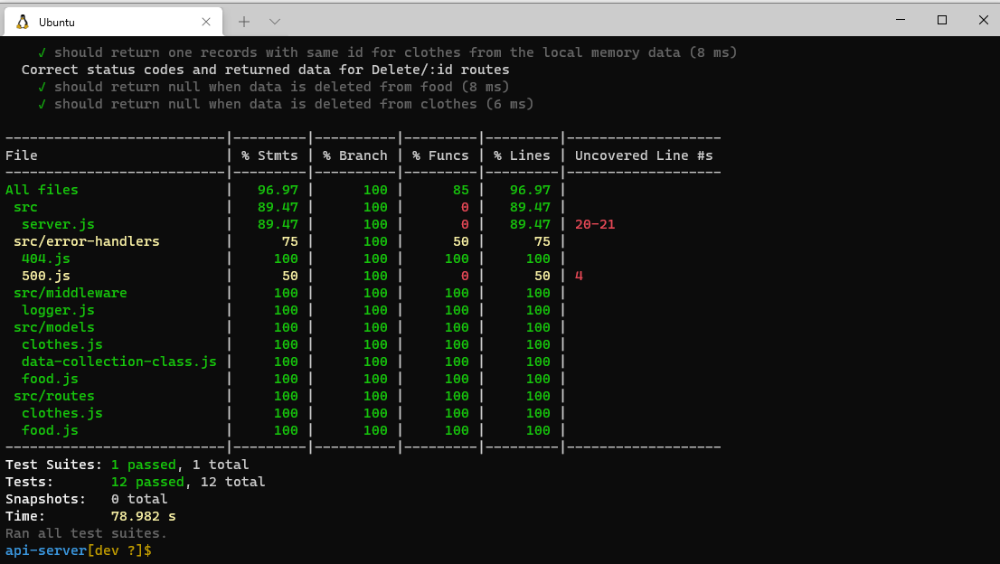
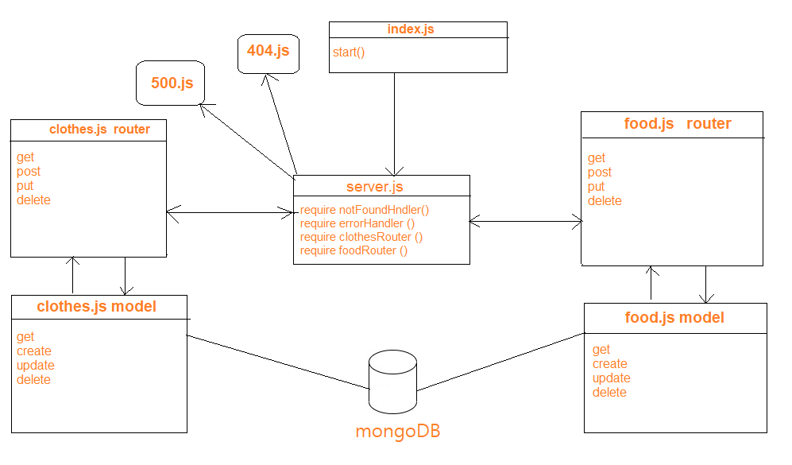

# api-server

## Author: anwar shraideh

## links

[heroku]()

[PR]()

## tests

## UML

## Setup

* Clone the repository from GitHub
* Install the dependences for tha app npm install
* Add your .env file and add PORT and  MONGODB_URI
* npm test
* npm start
